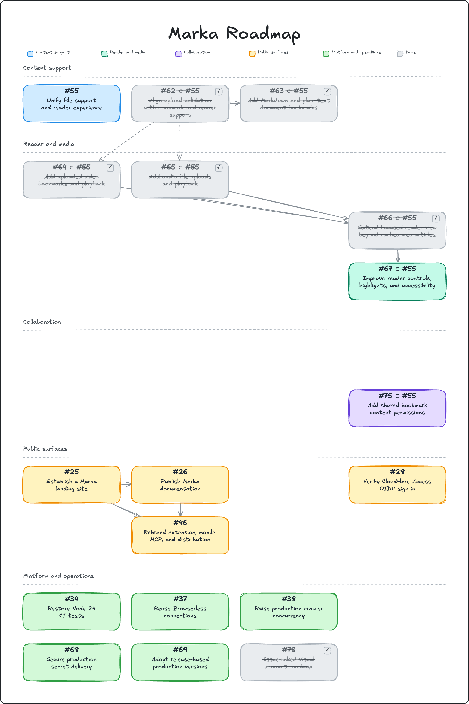

<div align="center">
  
</div>

<p align="center">
  <strong>A private library for everything worth keeping.</strong><br />
  Save links, notes, images, PDFs, and web pages, then find them again when they matter.
</p>

<p align="center">
  <a href="https://github.com/absolutepraya/marka/actions/workflows/ci.yml"></a>
  <a href="https://coderabbit.ai"></a>
  <a href="./LICENSE"></a>
  <a href="./.nvmrc"></a>
  <a href="./package.json"></a>
</p>

Marka is a self-hostable bookmark library built for people who want their saved knowledge close, searchable, and under their control.

## What you can do

- Save links, notes, images, PDFs, and web pages in one place
- Fetch titles, descriptions, previews, screenshots, and archived content automatically
- Organize everything with lists, tags, rules, and collaborative sharing
- Search across your saved content with full-text search
- Add highlights while reading and find them again later
- Use optional AI tagging and summarization, including local-model setups
- Capture content through browser extensions, RSS, CLI, API, and MCP tooling

## Self-host Marka

For a Linux `amd64` host with Docker Engine, Docker Compose v2, and OpenSSL already installed:

```bash
curl -fsSLo /tmp/marka-setup.sh https://raw.githubusercontent.com/absolutepraya/marka/main/scripts/install.sh && bash /tmp/marka-setup.sh
```

The guided installer configures the application, search, browser rendering, and optional AI. It writes secrets to restricted env files, validates the generated Compose stack, and starts the deployment.

The default listener is `127.0.0.1:3000`. For an Internet-facing deployment, put a reverse proxy with TLS in front of it. The installer does not install Docker, configure DNS, change firewall rules, or provision certificates.

For reproducible setup, replace `main` with a reviewed release tag or commit SHA:

```bash
REF=<tag-or-commit-sha>; curl -fsSLo /tmp/marka-setup.sh "https://raw.githubusercontent.com/absolutepraya/marka/${REF}/scripts/install.sh" && bash /tmp/marka-setup.sh
```

Read the [guided installation guide](docs/docs/02-installation/11-guided-docker-setup.md) for all configuration modes and rollback details.

Marka web and workers releases share an annotated `vMAJOR.MINOR.PATCH` Git tag.
The production Compose file and guided installer follow the paired `stable`
channel. Each release also keeps immutable version and source-commit image tags
so operators can roll back web and workers together.

After a successful CI run on `main`, the automatic release workflow classifies
the merged Conventional Commit messages. It creates the next annotated release
tag only for release-worthy changes, then the tag workflow publishes the paired
images and GitHub Release. Documentation-only and other explicitly non-release
changes do not create a version. Package manifest versions remain independent.

## Develop Marka

Start with [`CONTRIBUTING.md`](CONTRIBUTING.md) for contribution rules and [`docs/operator-setup.md`](docs/operator-setup.md) for local development and deployment workflows.

### Runtime prerequisites

The supported local development runtime is:

- Node.js 24.18.1 from [`.nvmrc`](.nvmrc)
- pnpm 11.2.1 through Corepack, as pinned in [`package.json`](package.json)
- Git and a Docker-compatible runtime, such as OrbStack on macOS
- [`wt`](https://github.com/absolutepraya/wt) for isolated worktrees

After the repository is configured, the normal development command is:

```bash
pnpm dev:start
```

`pnpm dev:start` runs the current worktree's web and workers processes. It reuses one machine-level Chrome/CDP service at `127.0.0.1:9250` and one Meilisearch service at `127.0.0.1:7700`. Each worktree keeps its own SQLite/assets directory, web port, and Meilisearch index namespace. Worktree slot 1 uses web port `3100`, slot 2 uses `3200`, and so on. Shared Chrome can be moved with `MARKA_DEV_CHROME_PORT` when the default port is occupied.

The repository is supported by [`wt`](https://github.com/absolutepraya/wt):

```bash
wt new ui-polish
wt ls
```

The project configuration in [`.wt/config.toml`](.wt/config.toml) prepares isolated dependencies, data, ports, and Meilisearch namespaces for each worktree.

### Pull production state into local development

Use the safe dry run first:

```bash
pnpm prod:pull-state --dry-run
```

The command reads the root `.env`, connects to the personal VPS, and replaces the current worktree's local data only when run without `--dry-run`. It backs up the existing `DATA_DIR` before restoring the full production `/data` volume.

The personal VPS compose project is `/home/praya/marka`, configured through `KARAKEEP_PROD_COMPOSE_DIR`. The service and export image have documented defaults in the script, while machine-specific values belong in `.env` and must not be committed.

<!-- ROADMAP:START -->
## Roadmap

<a href="./docs/roadmap/roadmap.excalidraw">
  <picture>
    <source media="(prefers-color-scheme: dark)" srcset="./docs/roadmap/roadmap-dark.png">
    <source media="(prefers-color-scheme: light)" srcset="./docs/roadmap/roadmap-light.png">
    
  </picture>
</a>

[Open the editable Excalidraw source](./docs/roadmap/roadmap.excalidraw)
<!-- ROADMAP:END -->

## License

Marka is licensed under [AGPL-3.0](LICENSE).

## Attribution

Marka builds on the open-source [Karakeep](https://github.com/karakeep-app/karakeep) project.
